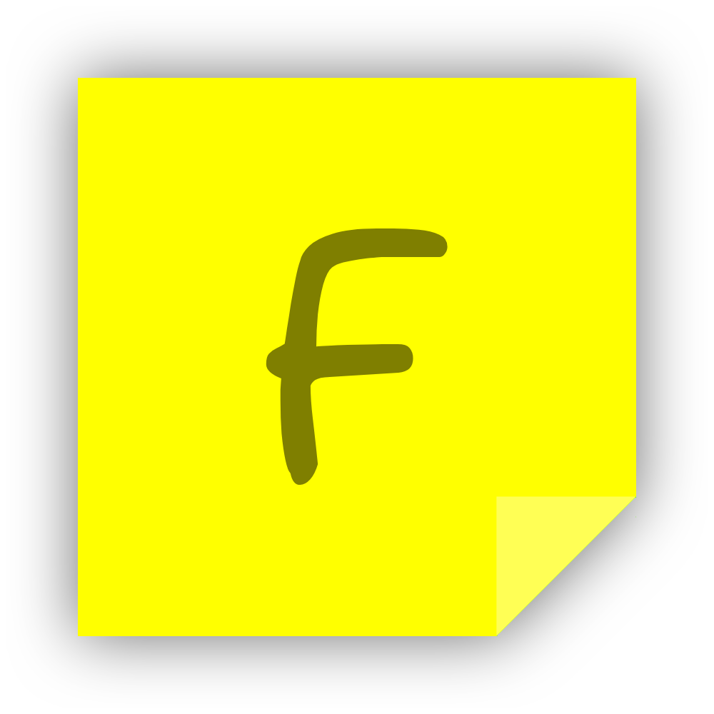

# Fastnote

     <strong>Notas rápidas usando Python</strong>

> [!WARNING]\
> ***ACTUALMENTE EN FASE ALPHA***  
> Muchas cosas pueden que cambien, se eliminen, mejoren en una futura actualización o puede que ni siquiera esten implementadas aún. Mira los ultimos [commits](https://github.com/horahenaripo/FastNote/commits/main/) para ver los cambios más recientes, y la lista de cosas por hacer [aquí]().

**Fastnote** es una aplicación para tomar notas rápidas, para aquellos que piensan que abrir Notepad es muy lento. Escrito en Python y usando Tkinter, permite crear una interfaz sencilla pero buena para el propósito de este proyecto.

<!-- ---
### Capturas
TODO

--- -->

## Características Principales

1. **Rápido:** ¡Al estar hecho en Python, la velocidad del programa ofrece una gran flexibilidad y rápida respuesta para anotar rápidamente lo que necesites!

2. **Personalizable:** Usando la configuración de la aplicación, puedes personalizar desde los atajos del teclado, idioma hasta la forma que se muestran las notas flotantes.

3. **Minimalista:** ¡La interfaz de usuario de Fastnote es simple, una ventana donde puedes escribir lo que necesitas, cierras y automáticamente se guarda tu nota!

4. **Idiomas:** Soporte para múltiples idiomas, lo que permite a los usuarios cambiar el idioma de la interfaz de usuario según tus preferencias. Además, es muy fácil de agregar/crear un nuevo idioma, solo sigue la guía en la wiki.

5. **Open source:** Al ser de código abierto, puedes ayudar a que este código crezca y mejore para todos, además al estar hecho en Python hace muy sencillo entender lo que hace el programa

<!-- 6. **Ligero:** La aplicacion solo utiliza 30 MB y una cantidad minima de CPU -->

## Cómo usar

### Requisitos

### Avisos

### Compilar

## Cómo ayudar

¡Las contribuciones son bienvenidas! Si deseas mejorar Fastnote o agregar nuevas características, eres libre de hacer un fork o de enviar un pull request para mejorar Fastnote.

## Lista de tareas
- [ ] Ventana de ajustes
- [ ] Recuperación de ajustes
- [ ] Agregar opciones de personalización
- [ ] Ventana de notas
- [ ] Mejorar UI
- [ ] Wiki guía de idiomas
- [ ] Optimización de código
- [ ] Mejorar legibilidad del código
- [ ] Mejorar rendimiento
- [ ] Fastnote++